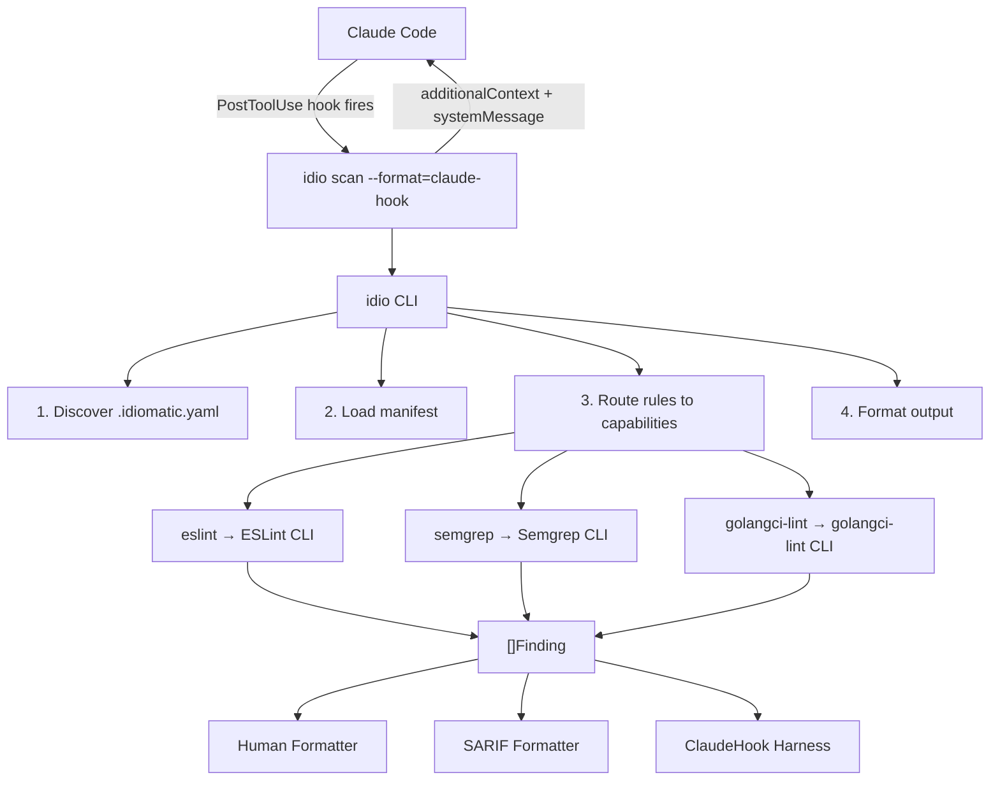

# Idiomatic — Architecture Overview

Idiomatic is a deterministic code enforcement engine that runs inside agentic coding sessions. The CLI (`idio`) loads config from `.idiomatic.yaml`, fetches capabilities and rule packs from git, dispatches analysis to external tools (ESLint, Semgrep), and reports findings. When integrated with Claude Code via the plugin, it creates a feedback loop: Claude writes code, the hook runs the analyzer, findings flow back into the session, and Claude fixes the code — converging to compliant output.

## System Architecture



## Core Concepts

### Capabilities
A capability is a named integration with an external analysis tool. Each is defined as a YAML file in the `capabilities/` directory. The engine contains zero analysis logic — it generates config, invokes the tool, and normalizes output.

| Capability | External Tool | Languages |
|---|---|---|
| `eslint` | ESLint 9 | TypeScript, React, JSX |
| `semgrep` | Semgrep | Go (extensible to any language) |
| `golangci-lint` | golangci-lint | Go |
| `gosec` | gosec | Go |
| `gitleaks` | gitleaks | Any |
| `git` | git | Any |
| `file-exists` | stat | Any |
| `file-contains` | grep | Any |

### Packs
YAML files containing rules. Each rule declares a capability and carries tool-specific config. Packs are pure data — adding or removing a rule requires no binary changes.

Packs come from three sources: **official** packs in this repository, **community** packs from public git repos, and **private** packs from private git repos. All use the same YAML format and are loaded via git clone from HTTPS URLs declared in `.idiomatic.yaml`.

```yaml
detector:
  capability: eslint
  config:
    rule: "@typescript-eslint/no-explicit-any"
    plugin: "@typescript-eslint/eslint-plugin"
    type_aware: false
```

## Repository Layout

```
idiomatic/
├── cmd/
│   └── idio/                    # idio CLI (the primary product)
│       └── cmd/                 # All CLI commands (scan, manifest, auth, config, version)
│
├── manifest/                    # Rule manifest parsing and validation (public)
│
├── internal/
│   ├── engine/                  # Analysis engine (the core)
│   ├── declarative/             # YAML capability runtime
│   ├── claudehook/              # Claude Code hook integration
│   └── output/                  # Formatters (human, SARIF)
│
├── capabilities/                # Capability definitions (YAML)
├── packs/                       # Rule packs (YAML)
├── schemas/                     # JSON Schema for YAML validation
├── docs/                        # Specs and authoring guides
│
├── plugin/                      # Claude Code plugin
│   ├── .claude-plugin/          # Plugin manifest
│   ├── hooks/                   # PostToolUse hook config
│   └── skills/                  # Skill instructions for Claude
│
├── testing/                     # Integration test environment
├── go.mod / go.sum              # Single Go module
└── Makefile                     # Build, test, install
```

## Data Flow

### CLI Scan (`idio scan ./src/`)
1. **Load config** — discover `.idiomatic.yaml`, clone repos, load capabilities and packs, validate rules, build rule index
2. **Collect files** — Walk target paths, collect source files
3. **Group by capability** — Rules grouped by `detector.capability`
4. **Detect tools** — Each capability checks if its external tool is installed; skip if unavailable
5. **Run capabilities** — Each capability generates tool config from rule configs, invokes the tool, parses output into findings
6. **Sort findings** — Deterministic: file → line → column → rule ID
7. **Format output** — Human, SARIF, or Claude Code hook response

### Claude Code Hook (`--format=claude-hook`)
1. Read PostToolUse JSON from stdin
2. Extract edited file path from `tool_input.file_path`
3. Load `.idiomatic.yaml` from project root, clone repos, load capabilities and packs
4. Route edited file to capabilities via `applies_to_files.extensions` in each capability YAML
5. Run analysis via matched capabilities
6. Budget decision: SARIF if under 9000 chars, compact summary above, truncation at 30
7. Wrap in hook response envelope (`additionalContext` string)

## Technology Stack

| Layer | Technology |
|---|---|
| CLI | Go, Cobra |
| Analysis | ESLint 9, Semgrep, golangci-lint, gosec, gitleaks |
| Manifest | gopkg.in/yaml.v3 |
| Output | SARIF 2.1.0 (typed Go structs) |
| Build | Make, Go modules |

## Key Design Principles

1. **Capability-based engine**: The engine is a thin orchestrator. All analysis is done by external tools. Adding a language = adding a YAML capability file.
2. **Self-describing packs**: Rules carry all tool-specific config. No hardcoded maps in the engine. Adding a rule = editing a YAML file.
3. **Graceful degradation**: Missing tools are reported clearly. The engine tells the user exactly which tool is missing and how to install it.
4. **Exit code contract**: `idio scan` exits 0 (clean), 1 (findings), 2 (error). `--format=claude-hook` always exits 0 — errors go in `additionalContext`.
5. **Rule ID stability**: IDs are permanent once published. Never reused.
