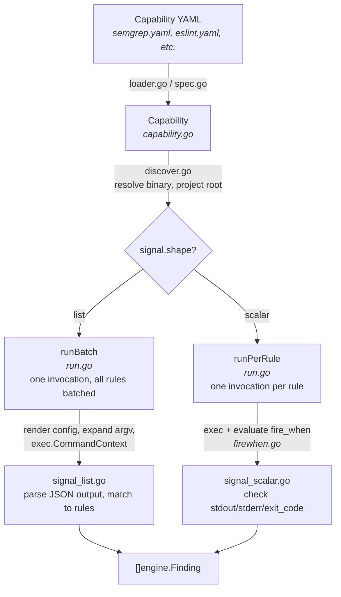

# internal/declarative

The YAML-driven capability runtime. Every external tool integration (semgrep, eslint, golangci-lint, etc.) is defined as a YAML file and executed by this package. There is no tool-specific Go code anywhere in the codebase.

## How it works

A capability YAML declares: what binary to run, what config to generate, how to invoke it, and how to parse its output. This package turns that declaration into executable analysis.

## File map

| File | Role |
|---|---|
| `spec.go` | `CapabilitySpec` — the Go struct that mirrors the YAML schema. The shape is Kubernetes-style: `apiVersion`, `kind`, `metadata`, `spec`. |
| `loader.go` | Reads YAML files from disk and parses them into `Capability` instances. Non-recursive directory walk. |
| `source.go` | `CloneRepo` — shallow-clones a git URL and caches it locally. The only way capabilities enter the system. |
| `bootstrap.go` | `Registry` — holds loaded capabilities. Provides `Add`, `BuildBackends`, `RouteFile`, and version constraint checking. |
| `capability.go` | `Capability` — implements `engine.Capability`. Dispatches to `analyzeList` or `analyzeScalar` based on `signal.shape`. |
| `discover.go` | Runtime binary and file discovery. Walks up from CWD to find binaries (`node_modules/.bin/eslint`) and config files (`tsconfig.json`). |
| `run.go` | Tool execution. Renders argv templates, writes temp config files, invokes `exec.CommandContext`, handles exit codes and timeouts. |
| `signal_list.go` | Parses list-mode tool output (JSON arrays). Extracts findings via gjson paths and matches them to rules by ID, input field, or linter name. |
| `signal_scalar.go` | Parses scalar-mode tool output (stdout/stderr/exit_code). Evaluates `fire_when` expressions to decide if a rule fires. |
| `firewhen.go` | Hand-rolled parser and evaluator for the `fire_when` expression language (`signal.stdout matches "regex"`, `and`, `or`, `not`). |
| `inputs.go` | Validates rule config against a capability's declared input schema (required fields, types). |
| `version.go` | Semver constraint parsing and matching. Used to enforce `detector.version` pins in rules. |

## Key concepts

**List vs scalar**: Capabilities declare `signal.shape: list` or `signal.shape: scalar`. List-mode runs the tool once and walks a JSON array of results. Scalar-mode runs the tool once per rule and checks stdout/stderr/exit_code against a `fire_when` expression.

**Template expansion**: Argv and config file templates use Go `text/template` with sprig functions. Tokens like `{project_root}`, `{tmp}`, `{config_file}` are expanded before template rendering.

**Temp file lifecycle**: The runtime creates and cleans up all temp files. Capability YAMLs declare paths using `{tmp}/...` patterns; the runtime resolves them to real tempfiles and removes them after the tool exits.
