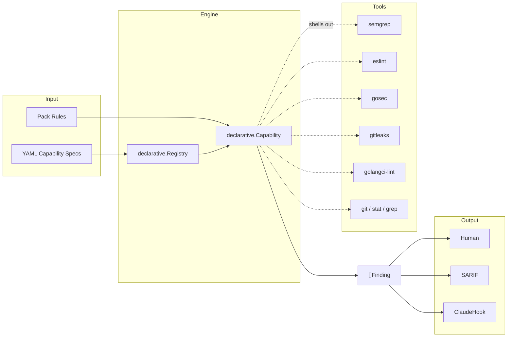

# internal/engine — Analysis Engine

The engine is the core of `idio`. It loads YAML capability specs from the filesystem, routes pack rules to the right capability, runs the underlying CLI tool, and normalizes the output into findings.

**Capability YAMLs are not bundled.** They live as plain files under `capabilities/` in git repos and are loaded via git clone from HTTPS URLs declared in `.idiomatic.yaml`. There is no `//go:embed`.

## Architecture



The engine contains **zero analysis logic and zero hand-coded tool wrappers**. Every tool integration is a YAML file at `<repo>/capabilities/<name>.yaml`, loaded from disk by the same mechanism that loads rule packs. The Go side is one generic `declarative.Capability` type that interprets the YAML.

## Directory Structure

```
internal/
├── engine/
│   ├── capability.go       # Capability interface + registry
│   ├── adapter.go          # CapabilityBackendAdapter
│   └── types.go            # Finding, Backend interface
├── declarative/            # Generic YAML-driven capability runtime
│   ├── spec.go             # CapabilitySpec schema
│   ├── loader.go           # LoadPath / LoadPaths / LoadFS — filesystem-based
│   ├── source.go           # Source resolution: git clone from HTTPS URLs
│   ├── bootstrap.go        # Registry: NewRegistry, Add, BuildBackends, RouteFile
│   ├── capability.go       # The Capability type that implements engine.Capability
│   ├── discover.go         # Per-invocation discovery (binary walk-up, file walk-up, prechecks)
│   ├── run.go              # Tool invocation (per:batch|rule|file, sprig templates, exec)
│   ├── signal_list.go      # List-mode signals (single + nested-list walks)
│   ├── signal_scalar.go    # Scalar-mode signals
│   └── firewhen.go         # Tiny fire_when expression parser+evaluator
├── claudehook/             # Claude Code hook integration
└── output/                 # Formatters (human, SARIF)
```

There are no `capabilities/` subpackages and no `//go:embed`. Capability YAMLs live at the **repo root** under `capabilities/` and are loaded by the same path-based mechanism that loads rule packs.

## Where things live

| Path | Purpose |
|---|---|
| `<repo>/capabilities/*.yaml` | The canonical capability set: semgrep, gosec, gitleaks, golangci-lint, eslint, git, file-exists, file-contains. Loaded from disk like rule packs. |
| `declarative/spec.go` | The `CapabilitySpec` schema (sections: requires, inputs, applies_to_files, run, signal) |
| `declarative/loader.go` | `LoadPath` / `LoadPaths` / `LoadFS` — filesystem and `fs.FS` loaders |
| `declarative/source.go` | `CloneRepo` — git shallow clone with local caching |
| `declarative/bootstrap.go` | `Registry` (`NewRegistry`, `Add`, `BuildBackends`, `RouteFile`) — the single source of truth for loaded capabilities |
| `declarative/capability.go` | The generic `Capability` type that implements `engine.Capability` |
| `declarative/discover.go` | Per-invocation discovery: walk-up binary, walk-up files, prechecks |
| `declarative/run.go` | Tool invocation: per-batch / per-rule / per-file dispatch, sprig template rendering, exec |
| `declarative/signal_list.go` | List-mode signals: gjson extraction, single- and nested-list walks, rule-id strategies |
| `declarative/signal_scalar.go` | Scalar-mode signals: per-rule fire_when expression evaluation |
| `declarative/firewhen.go` | Tiny recursive-descent parser for fire_when expressions |
| `harnesses/claudehook` | Claude Code PostToolUse hook integration |
| `output/` | Formatters: human, SARIF |

## The CapabilitySpec sections

```yaml
name: <unique capability id, also the routing key>
description: <one-liner>

# Which files this capability cares about. Used by the file router (claudehook)
# and to filter req.Files at invocation time.
applies_to_files:
  extensions: [".go"]   # omit entirely to receive all files

# How to find the binary and what context it needs.
requires:
  binary: <name>
  install: <hint>
  discover:               # optional: walk_up_from_cwd looking for a relative path
    strategy: walk_up_from_cwd
    relative: node_modules/.bin/eslint
    fallback_to_path: true
  discover_files:         # optional: locate files and expose as {discovered.<var>}
    - var: tsconfig
      name: tsconfig.json
      walk_up_from: cwd
      optional: true
  precheck:               # optional: preflight checks before invocation
    - kind: file_exists
      path: "{project_root}/node_modules/{{ .Value }}"
      for_each_unique_input: plugin
      skip_values: ["@typescript-eslint/eslint-plugin"]
      error_message: "plugin {{ .Value }} not installed"

# What inputs each rule must supply (rule-side schema).
inputs:
  rule: { type: string, required: true }
  plugin: { type: string }
  type_aware: { type: any }

# How to invoke the tool.
run:
  per: batch | rule | file
  config_file:                     # optional: render a config file from the rules
    path: "{tmp}/foo.yaml"          # or "{project_root}/.idio-foo-{pid}.mjs"
    template: |
      <sprig + go-template body, with .Rules, .ProjectRoot, .Discovered, .Pid>
  argv:
    - --config
    - "{config_file}"
    - "{files}"                     # expands to multiple argv entries
  rule_argv_field: argv             # per:rule capabilities can pull argv from rule input
  timeout: 60s
  ok_exit: [1]                      # exit codes that mean "findings found, parse output"
  output: stdout | report_file
  report_path_pattern: "{tmp}/foo.json"  # only when output: report_file
  files_as_dirs: false              # set true for tools that take directories (golangci-lint)

# How to project the tool's output into findings.
signal:
  shape: list | scalar
  source: stdout | report_file
  format: json
  list: results                    # gjson path to the outer array
  nested_list: messages            # optional: walk inner array on each outer item
  parent_fields:                   # outer fields projected onto inner items
    file: filePath
  match_rule_by:
    strategy: by_id | by_input | linter_contains
    from: check_id                 # gjson path on the inner item
    transform: tail_after_dot      # optional
    field: rule_id                 # which rule input names the upstream id
  fields:
    file:    parent.file            # parent.<alias> reads from the projected map
    line:    line
    col:     column
    message: message
    severity: severity
  severity_map:
    "1": warning
    "2": error
  # Scalar-mode fields:
  scalar_fields:
    stdout:    { from: stdout, transform: trim }
    exit_code: { from: exit }
  fixed_file: "{project}/.git/HEAD"
```

## Loading capabilities

All capabilities are loaded via git clone from HTTPS URLs declared in `.idiomatic.yaml` (`kind: ProjectConfig`). Each entry specifies a `repo:` (plain HTTPS URL) and `path:` (array of file paths within that repo):

```yaml
capabilities:
  - repo: https://github.com/adamgilman/idiomatic
    path:
      - capabilities/semgrep.yaml
      - capabilities/eslint.yaml
```

The cache lives under `$XDG_CACHE_HOME/idiomatic/`. There are no filesystem path sources, no shortcut prefixes, and no environment variable overrides.

## Adding a capability

Drop a YAML file in `<repo>/capabilities/<name>.yaml` and reference it in your project's `.idiomatic.yaml` under the `capabilities:` section. No Go code changes are needed. The canonical set covers the existing tool integrations; new ones use the same schema.

If you find yourself reaching for Go code to make a capability work, that's a signal the schema is missing a feature — extend the schema instead. Eslint was the original snowflake (walk-up `node_modules`, `tsconfig.json` discovery, plugin presence checks, project-root config writes, nested JSON output). All of those are now generic schema features (`requires.discover`, `requires.discover_files`, `requires.precheck`, `config_file.path: "{project_root}/..."`, `signal.nested_list` + `parent_fields`).

Same principle for distribution: there are no embedded YAMLs. If you find yourself reaching for `//go:embed` to bundle a capability, that's wrong — capabilities are data files loaded from the filesystem, just like rule packs.

## Versioning

Every capability declares `metadata.version` (semver). Rules can pin to a version constraint via `detector.version` in the rule pack -- accepted forms are everything `Masterminds/semver/v3` supports (exact, caret, tilde, range, wildcard).

`Registry.CheckRuleVersions` (called from `cmd/idio/cmd/scan.go` after the registry is loaded but before any tool runs) validates each rule's constraint against the loaded capability and returns a `VersionMismatch` error on the first failing rule. Constraints with malformed syntax are caught earlier, in `manifest/validate.go`, so authoring typos surface as a validation error.

When to bump capability version:

- **Patch** (1.0.0 -> 1.0.1) -- bug fix that doesn't change rule behavior
- **Minor** (1.0.0 -> 1.1.0) -- backwards-compatible additions (new optional inputs, new optional spec fields)
- **Major** (1.0.0 -> 2.0.0) -- breaking changes (renamed inputs, changed `match_rule_by` strategy, changed signal projection)

If you bump a major version, every rule pinned to the previous major must be reviewed.

## Key abstractions

- `engine.Capability` — the contract every capability satisfies. The only implementation is `declarative.Capability`.
- `engine.Finding` — normalized result. Every signal projection produces these.
- `engine.Backend` — legacy adapter interface used by routing code; bridged via `CapabilityBackendAdapter`.
- `declarative.Registry` — single source of truth for the loaded capability set. Provides `Add`, `BuildBackends`, `RouteFile`.
- `declarative.CloneRepo` (`declarative/source.go`) — shallow-clones a git repo URL, returns cached local path.

## Patterns

- Capabilities are stateless. The YAML spec is immutable after parsing.
- Temp files: the runtime owns lifecycle (`os.CreateTemp` + `defer os.Remove`). YAMLs only describe filenames via the `{tmp}/foo.json` placeholder pattern. `{project_root}` writes go directly to the resolved path with the same defer cleanup.
- Tool exit code 1 means findings found — declare with `run.ok_exit: [1]`. The runtime catches exit-code errors and routes to parsing.
- Tool stderr is captured and surfaced only on non-ok exits.
- `systemMessage` in hook responses is computed in `harnesses/claudehook/claudehook.go` from findings, not in capabilities.

## Anti-patterns

- Embedding analysis logic in Go (write a YAML capability instead)
- Hardcoded rule maps (read from `rule.Detector.Config`, indexed by the capability's `match_rule_by` strategy)
- Putting cleanup logic in template helpers (the runtime owns lifecycle)
- Adding a hand-coded Go capability for "just one tool that needs X" (extend the schema)
- Using `//go:embed` to bundle capability YAMLs (load from the filesystem like rule packs)
